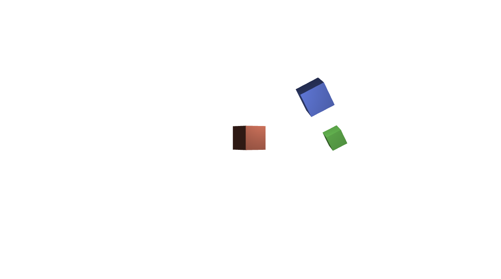
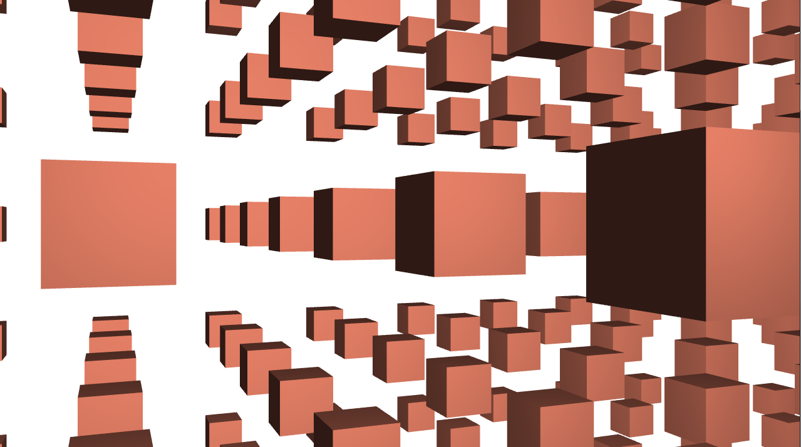

# Examples
Sample scenes to demonstrate the capabilities of *pysg*.

## 01 Simple Scene

Simple rotating 3D cube.


## 02 Headless Renderer

Render the same simple scene of a rotating 3D cube, but instead of using a QT5 window the scene will be rendered to an image using the headless renderer.

## 03 Hierarchy Scene
Rotating cubes in a scene hierarchy.



## 04 3D Objects
All possible 3D objects.

<!---
TODO add image once all 3D objects are ready
[SimpleScene](img/HierarchyScene.png)-->

## 05 Performance
Render a large amount of cubes to show pysg performance.



## Dependencies
Additionally depends on *PyQt5* for rendering the scenes to a canvas and *Pillow* for image handling for the headless renderer. 

```
pip install -r requirements.txt
```
